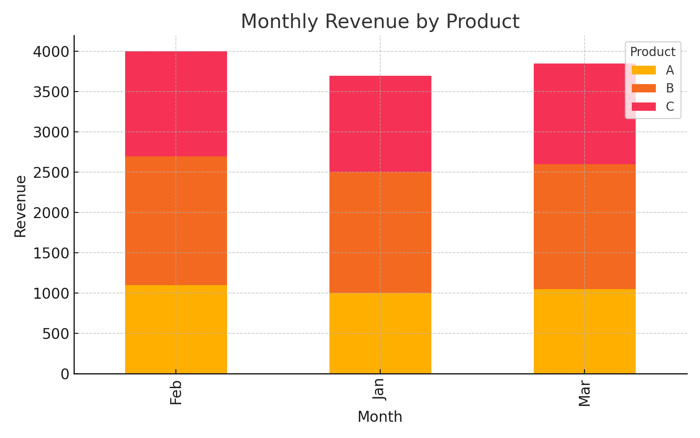

# 🧾 Auto Excel Sales Report Generator

Automatically merge multiple Excel files, summarize sales by product and month, and generate a visual report in Excel with an embedded chart — all with one Python script! ✅

## 📂 Features
- Merge unlimited `.xlsx` files in a folder
- Group by Month & Product to summarize revenue
- Generate a stacked bar chart
- Embed the chart into Excel report
- Save as `Auto_Sales_Report.xlsx`

## 🚀 How to Use
1. Put your Excel files in `/sales_data/` folder
2. Run `main.py`
3. Done! Your summarized report will be saved automatically

## 📦 Sample Input
Check `sales_data/example_data.xlsx` — it contains:
- Columns: `Month`, `Product`, `Revenue`
- Sample products: A, B, C
- Data for Jan–Mar

## 📊 Example Output


## 🛠️ Dependencies
- Python 3.8+
- pandas
- openpyxl
- matplotlib

Install via:
```bash
pip install pandas openpyxl matplotlib
```

---

Made to automate your reporting workflow 📈
